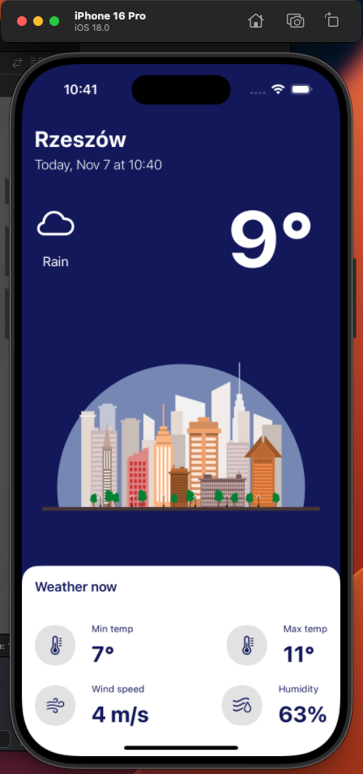

# Weather-app
Application appearance: 
The weather application enables users to ascertain fundamental meteorological data. The displayed weather information is derived from the user's current location and is obtained through a data download from the OpenWeather website.
